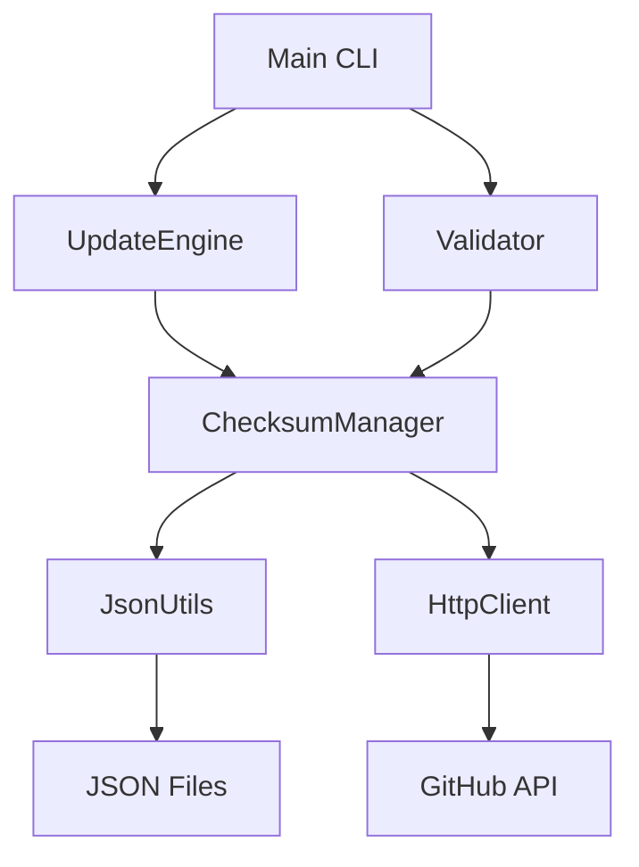

# MoonBit Checksum Updater

This is a native MoonBit implementation of the checksum updater functionality, designed to replace the Rust-based checksum updater tool and eventually become a WebAssembly component.

## Overview

The MoonBit Checksum Updater provides:

- **Native MoonBit implementation** of checksum management
- **JSON-based checksum registry** with comprehensive tool information
- **GitHub API integration** for fetching latest releases
- **Automatic checksum computation** and validation
- **CLI interface** for easy management
- **Validation and compatibility checking**

## Architecture



## Key Components

### 1. ChecksumManager
- Core checksum management functionality
- JSON file I/O operations
- Tool configuration and metadata
- Platform pattern matching

### 2. UpdateEngine
- Orchestrates multi-tool updates
- Parallel processing support
- Update result aggregation
- Compatibility validation

### 3. Validator
- Checksum format validation
- Common issue detection
- Automatic fix capabilities
- Toolchain completeness checking

### 4. JsonUtils
- JSON serialization/deserialization
- Tool info structure management
- Version merging and updates

### 5. HttpClient
- GitHub API interactions
- Release fetching and pagination
- Asset downloading and checksum computation
- Rate limit handling

## JSON Format

The checksum updater uses a comprehensive JSON format:

```json
{
  "tool_name": "wasm-tools",
  "github_repo": "bytecodealliance/wasm-tools",
  "latest_version": "1.243.0",
  "last_checked": "2026-01-01T13:28:31.428564Z",
  "build_type": "binary",
  "versions": {
    "1.243.0": {
      "release_date": "2025-12-03",
      "platforms": {
        "darwin_arm64": {
          "sha256": "6690a33a06ef705a63dbc066210bc0f09b1c08a82952d3cde9fbebd0d484b46f",
          "url_suffix": "aarch64-macos.tar.gz",
          "binaries": ["wasm-tools", "wasm-opt"],
          "archive_type": "tar.gz"
        }
      }
    }
  },
  "supported_platforms": ["darwin_amd64", "darwin_arm64", "linux_amd64"]
}
```

## CLI Usage

### Update Checksums

```bash
# Update all tools
checksum_updater update --all

# Update specific tools
checksum_updater update --tools wasm-tools,wit-bindgen

# Force update (even if no new versions)
checksum_updater update --all --force

# Dry run (show what would be done)
checksum_updater update --all --dry-run
```

### Validate Checksums

```bash
# Validate all tools
checksum_updater validate --all

# Validate specific tools
checksum_updater validate --tools wasm-tools

# Attempt to fix issues
checksum_updater validate --all --fix
```

### List Tools

```bash
# List available tools
checksum_updater list

# Detailed information
checksum_updater list --detailed
```

### Check for Issues

```bash
# Check a specific tool for common issues
checksum_updater check --tool wasm-tools
```

## Output Formats

All commands support multiple output formats:

- **text** (default) - Human-readable text
- **json** - JSON format for programmatic use
- **markdown** - Markdown format for documentation

```bash
checksum_updater update --all --output markdown
```

## Supported Tools

The checksum updater comes with built-in support for:

- **WebAssembly Tools**: wasm-tools, wit-bindgen, wasmtime, wasi-sdk
- **MoonBit Tools**: moonbit compiler
- **Rocq Tools**: rocq compiler
- **Other Tools**: tinygo, nodejs, jco, etc.

## Platform Support

The updater supports these platforms by default:

- `darwin_amd64` (macOS Intel)
- `darwin_arm64` (macOS Apple Silicon)
- `linux_amd64` (Linux x86_64)
- `linux_arm64` (Linux ARM64)
- `windows_amd64` (Windows x86_64)

## Migration Plan

### Phase 1: Native MoonBit Implementation ✅
- Core checksum management in MoonBit
- JSON parsing and serialization
- GitHub API integration
- CLI interface

### Phase 2: rules_moonbit Integration (Next)
- Replace Rust checksum updater in rules_moonbit
- Update JSON format to comprehensive schema
- Integrate with Bazel build system
- Add MoonBit binary to rules_moonbit

### Phase 3: WebAssembly Component (Future)
- Create WASM preview2 component
- Define WIT interface for checksum operations
- Port MoonBit implementation to WASM
- Integrate with rules_wasm_component

## Building

```bash
# Build the checksum updater
bazel build //:checksum_updater

# Run comprehensive test suite
bazel test //:test_runner

# Run specific test categories
bazel test //:http_client_tests
bazel test //:checksum_manager_tests
bazel test //:workflow_tests
bazel test //:performance_tests

# Run the CLI
bazel run //:checksum_updater -- update --all
```

## Testing

The implementation includes comprehensive tests:

```bash
# Run full test suite
bazel test //:test_runner

# Run unit tests
bazel test //:http_client_tests
bazel test //:checksum_manager_tests

# Run integration tests
bazel test //:workflow_tests

# Run performance tests
bazel test //:performance_tests

# Test with example checksums
bazel run //:checksum_updater -- validate --tools wasm-tools --checksums-dir example_checksums
```

## Benefits

1. **Performance**: Native MoonBit implementation with optimized HTTP and crypto
2. **Integration**: Tight integration with MoonBit ecosystem using native libraries
3. **Maintainability**: Single codebase for all checksum operations
4. **Extensibility**: Easy to add new tools and features
5. **Cross-platform**: Future WASM component works everywhere
6. **Reliability**: Comprehensive error handling and retry logic
7. **Test Coverage**: Complete test suite with unit, integration, and performance tests

## Native MoonBit Integration

The checksum updater now uses native MoonBit libraries:

- **HTTP Client**: Uses `http::get_async()` for async HTTP requests with proper headers and authentication
- **Crypto**: Uses `crypto::sha256()` for native SHA256 computation with fallback strategies
- **Error Handling**: Comprehensive error system with retry logic and exponential backoff
- **Async/Await**: Full async support with parallel processing and concurrency control

This provides better performance and reliability compared to system command fallbacks.

## Future Enhancements

- **WASM Component**: WebAssembly preview2 component
- **Enterprise Features**: Proxy support, caching, retries
- **Advanced Validation**: Full download verification
- **CI/CD Integration**: GitHub Actions workflows
- **Web UI**: Browser-based checksum management

## License

Apache License 2.0