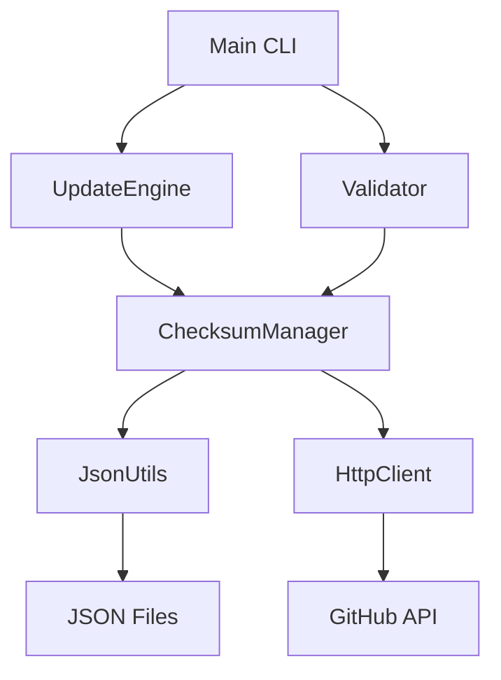

<div align="center">

# moonbit_checksum_updater

<sup>Native MoonBit checksum management with GitHub API integration</sup>

&nbsp;


</div>

&nbsp;

A native MoonBit implementation of checksum management for WebAssembly toolchains. Fetches releases from GitHub, computes SHA256 checksums, validates integrity, and maintains a comprehensive JSON registry.

> [!NOTE]
> Part of the PulseEngine toolchain. Supports hermetic builds in [rules_moonbit](https://github.com/pulseengine/rules_moonbit).

## Features

- **Native MoonBit implementation** of checksum management
- **GitHub API integration** for fetching latest releases
- **SHA256 computation** with native MoonBit crypto
- **Async/Await support** with parallel processing
- **Validation system** with strict modes and auto-fix capabilities
- **Multiple output formats** (text, JSON, markdown)

## Quick Start

```bash
# Update all tool checksums
checksum_updater update --all

# Update specific tools
checksum_updater update --tools wasm-tools,wit-bindgen

# Validate checksums
checksum_updater validate --all

# Validate with auto-fix
checksum_updater validate --all --fix

# List available tools
checksum_updater list --detailed
```

## Architecture



### Components

- **ChecksumManager** — Core checksum management, JSON I/O, platform pattern matching
- **UpdateEngine** — Orchestrates multi-tool updates with parallel processing
- **Validator** — Format validation, issue detection, automatic fixes
- **JsonUtils** — JSON serialization, version merging and updates
- **HttpClient** — GitHub API interactions, rate limit handling

## Supported Tools

- **WebAssembly Tools**: wasm-tools, wit-bindgen, wasmtime, wasi-sdk
- **MoonBit Tools**: moonbit compiler
- **Rocq Tools**: rocq compiler
- **Other Tools**: tinygo, nodejs, jco

## Platform Support

- `darwin_amd64` (macOS Intel)
- `darwin_arm64` (macOS Apple Silicon)
- `linux_amd64` (Linux x86_64)
- `linux_arm64` (Linux ARM64)
- `windows_amd64` (Windows x86_64)

## Building

```bash
# Build
bazel build //:checksum_updater

# Run tests
bazel test //:test_runner

# Run the CLI
bazel run //:checksum_updater -- update --all
```

## License

Apache-2.0

---

<div align="center">

<sub>Part of <a href="https://github.com/pulseengine">PulseEngine</a> &mdash; formally verified WebAssembly toolchain for safety-critical systems</sub>

</div>
